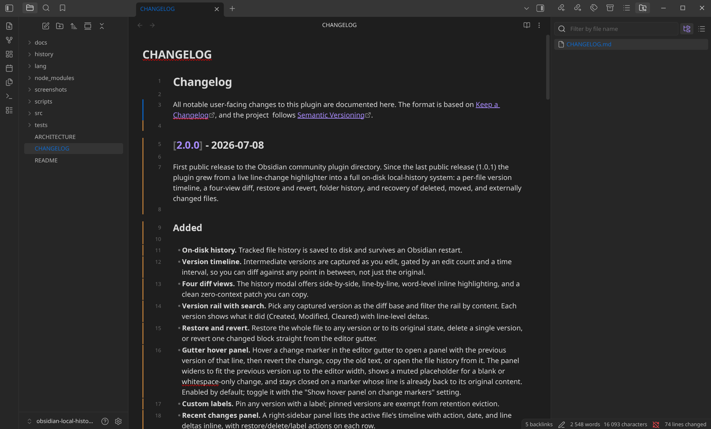
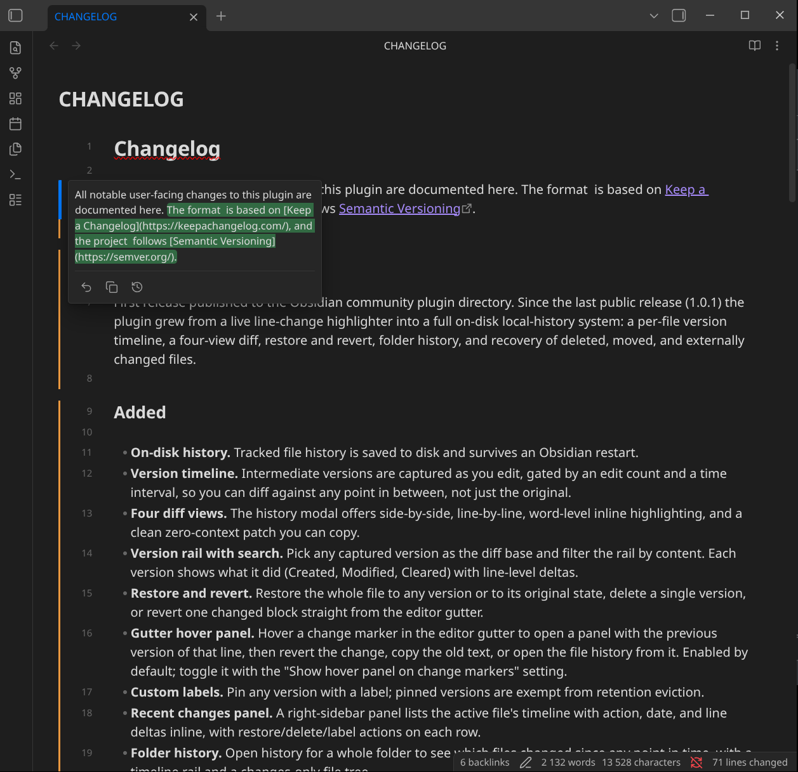
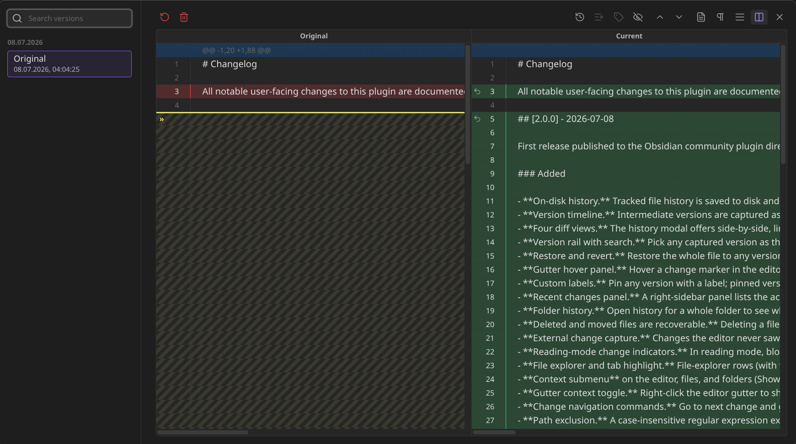
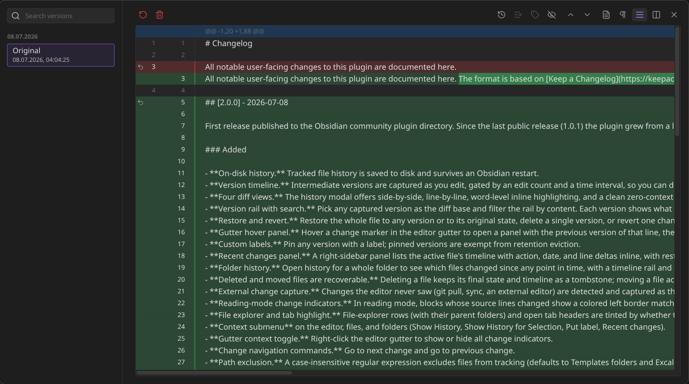
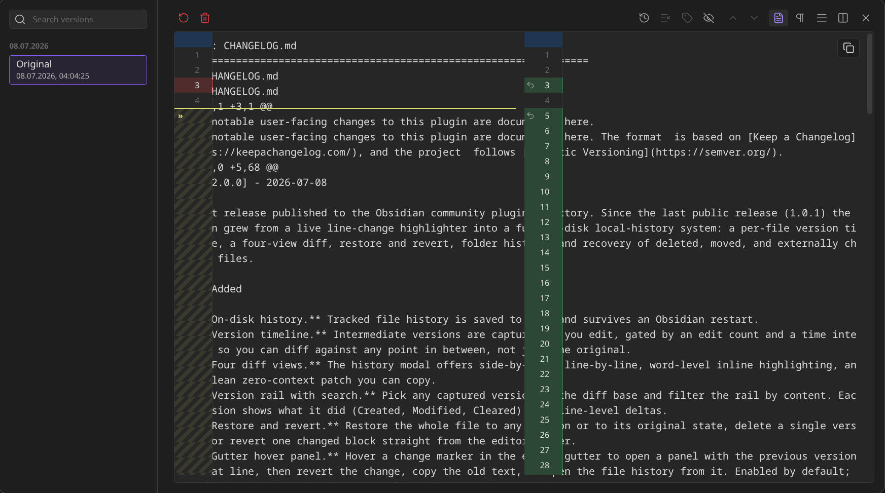
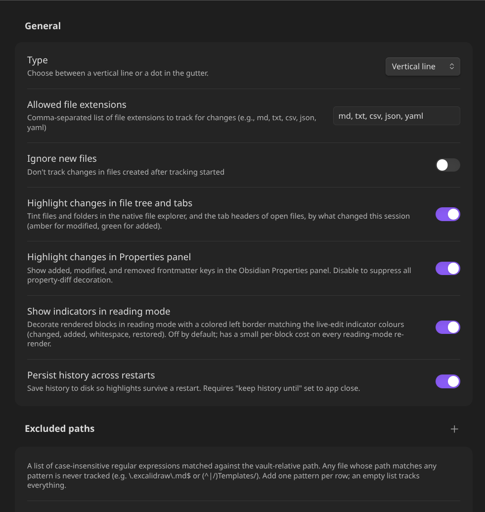

# Local History

[](https://github.com/bartlab/obsidian-local-history/releases/latest)
[](https://github.com/bartlab/obsidian-local-history/releases)

Local History gives every note its own on-disk version history, JetBrains style. It highlights the lines you change as you type, captures a timeline of earlier versions that survives restarts, and lets you diff, restore, or revert any point, all fully local with no account and no network. It follows a show-but-do-not-interfere principle: useful feedback during long edits, large-note refactors, multi-author reviews, or recovery from a bad sync or git pull, without getting in the way.

It complements Obsidian [Sync version history](https://obsidian.md/help/sync/version-history) rather than replacing it. Sync keeps periodic server-side snapshots as a paid cloud backup; this plugin gives immediate in-editor feedback plus a free local per-file time machine that also tracks deleted and moved files. The two work together.

## Features

- Live per-line highlighting in Source and Live Preview modes. Changed, added, removed, restored, and whitespace-only lines each get their own marker, shown as a colored gutter bar or a single gutter character. Markers are session-scoped and clear when a line returns to its original state.
- Whitespace-only edits get a distinct indicator color so you can tell them apart from real content changes.
- File-explorer rows and workspace tab headers tint by what changed this session, so the tree and tab bar agree with the editor gutter at a glance.
- Optional reading-mode block indicators and a properties-panel diff, each toggled in settings.
- On-disk timeline per file, captured on an edit-count and time interval so it records meaningful points rather than every keystroke, with independent retention caps for live files and for deleted-file tombstones. Pin any version with a label to protect it from eviction.
- Diff modal with four views (side-by-side, line-by-line, word-level inline, and a clean zero-context patch you can copy), a searchable version rail, and next/previous difference navigation.
- Restore a whole file to any version or to its original state, or revert a single changed block straight from the editor gutter.
- Recent changes side panel listing the active file's timeline with action, date, and line deltas.
- Folder history: a changes-only file tree plus a timeline rail for a whole folder, with restore, delete, and label actions on the selected file.
- Deleted and moved files are kept as recoverable tombstones instead of being dropped; changes the editor never saw (a git pull, a sync, an external editor) are detected, captured, and marked with an inline badge.

## Screenshots

| Gutter change bars in the editor | Gutter hover panel |
| :---: | :---: |
| [](screenshots/editor-gutters.png) | [](screenshots/editor-hover-panel.png) |
| **Diff, side by side** | **Diff, line by line** |
| [](screenshots/diff-side-by-side.png) | [](screenshots/diff-line-by-line.png) |
| **Diff, copyable patch** | **Settings** |
| [](screenshots/diff-patch.png) | [](screenshots/settings.png) |

## Installation

Requires Obsidian 1.11.0 or newer (see `manifest.json`); runs on desktop and mobile.

**Community plugins (pending review):** once listed, install from Settings, then Community plugins, then Browse for "Local history".

**Via [BRAT](https://github.com/TfTHacker/obsidian42-brat):** install and enable BRAT, choose "Add Beta plugin", and enter `https://github.com/bartlab/obsidian-local-history`.

**Manual:** download the latest [release](https://github.com/bartlab/obsidian-local-history/releases), copy `main.js`, `manifest.json`, and `styles.css` into `VaultFolder/.obsidian/plugins/local-history/`, reload Obsidian, and enable the plugin.

## Configuration

Open Settings, then Community plugins, then Local history. Most options are self-describing; the non-obvious ones:

- Any retention or snapshot count/age field accepts `0` to disable that particular cap.
- **Excluded paths** are regular-expression patterns, each matched independently against the vault-relative path; a file is excluded when any pattern matches. Patterns are case-insensitive unless "Case-sensitive path exclusion" is on.
- **Persist history across restarts** requires "Keep history until" set to app close.

### Custom CSS example

The indicator colors resolve from CSS variables, so a snippet can recolor every surface at once:

```css
/* Recolor the editor gutter bars and reading-mode block indicators. */
.lct,
.lct-rm-indicator {
    --lct-color-changed: #4a9eff;
    --lct-color-added: #ff6b35;
    --lct-color-restored: #fcdb89;
    --lct-color-removed: #b6b6b6;
}

/* Or target a single change type on the gutter bar directly. */
.cm-gutter.lct-gutter-bar-col .lct-added .lct-gutter-bar {
    background-color: #4ecdc4;
}
```

## Privacy and data storage

The plugin runs entirely on your device: no network access, no telemetry, no account. History is stored as JSON shards under `.obsidian/plugins/local-history/history/` in your vault, each holding the captured file text needed to diff and restore.

If you version-control or cloud-sync your vault configuration, those shards ride along unless you exclude them:

- **Git:** add `.obsidian/plugins/local-history/history/` to your `.gitignore`.
- **Cloud sync or Obsidian Sync config sync:** exclude that folder, or disable config-folder sync for the plugin.

## Localization

The plugin follows Obsidian's UI language, shipping a dictionary per language under `lang/<code>.json` and falling back to English. To add a translation, copy `lang/en.json` to `lang/<code>.json` (using the exact [Obsidian language code](https://github.com/obsidianmd/obsidian-translations)), translate every value while keeping the keys and `{name}` placeholders intact, register the catalog in `src/helpers/i18n.helper.ts`, and add it to `tests/i18n-catalog-parity.test.ts`.

## Support

If this plugin is useful to you:

[](https://coff.ee/bartlaba)

## Developing

```bash
npm install
npm run dev        # build in watch mode
npm run build      # type-check and build for production
npm run lint       # run ESLint
npm test           # run the Jest suite
```

For the architectural rationale and history-model invariants, see [ARCHITECTURE.md](ARCHITECTURE.md). For the release history, see [CHANGELOG.md](CHANGELOG.md).

## License

Licensed under the MIT License. See [LICENSE](LICENSE) for details.
