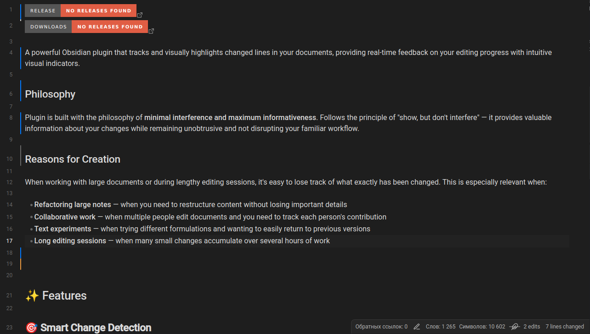

# Local History

[](https://github.com/bartlab/obsidian-local-history/releases/latest)
[](https://github.com/bartlab/obsidian-local-history/releases)

An Obsidian plugin that gives every note its own local history. It highlights the lines you change as you type, keeps a timeline of earlier versions on disk, and lets you diff, restore, or revert any point in that history, all without an account or a network connection.

Think of it as JetBrains-style Local History for your vault: a free, fully local safety net that sits underneath Obsidian and remembers what changed, even across restarts.

## Philosophy

The plugin is built around minimal interference and maximum informativeness. It follows the principle of "show, but don't interfere": it surfaces useful information about your changes while staying out of the way and not disrupting your usual workflow.

## Why use it

During long editing sessions or while working with large documents, it is easy to lose track of what exactly has changed. This is especially helpful when:

- Refactoring large notes, where you restructure content without losing important details.
- Reviewing contributions, where several people edit a document and you want to see what changed.
- Experimenting with text, where you try different wordings and want to return to a previous version.
- Running long editing sessions, where many small changes accumulate over hours of work.
- Recovering after an accident, where a sync conflict, a bad git pull, or a deleted file would otherwise lose work.

## How it compares to Obsidian Sync version history

Obsidian Sync provides a built-in [version history](https://obsidian.md/help/sync/version-history) feature. The two solutions solve different problems and can be used together:

| Aspect | Local History (this plugin) | Obsidian Sync version history |
| --- | --- | --- |
| Cost | Free, no account | Paid, part of Obsidian Sync |
| Scope | Live in-editor tracking plus an on-disk timeline | Periodic server-side snapshots |
| Granularity | Per-line highlighting as you type, plus captured versions | Per-snapshot file versions |
| Diff view | Side-by-side, line-by-line, word-level inline, and patch | Version contents, no line-level diff |
| Storage | On disk, in the plugin folder, survives restarts | Cloud, retained for 1 to 12 months by plan |
| Deleted/moved files | Kept as recoverable tombstones | Covered by cloud retention |
| Network | Fully local, no network access | Requires sync to Obsidian servers |

In short, this plugin focuses on immediate, in-session visual feedback and a local time machine for each file, whereas Sync version history is a long-term cloud backup of file versions.

## Features

### Live change highlighting

- Highlights changed lines in editing modes (Source and Live Preview) with customizable markers.
- Two indicator styles: a vertical colored line, or a single character in the gutter.
- Separate styles for changed, added, removed, and restored lines.
- Markers disappear automatically when a line returns to its original state.
- Markers are session-scoped: they show what changed since you opened the file in the current app run, so a long-lived note does not slowly mark up as "all changed".
- Right-click the editor gutter to toggle all change indicators on or off.

### On-disk history and timeline

- Captures a timeline of earlier versions as you edit, gated by an edit count and a time interval so it records meaningful points, not every keystroke.
- History is saved to disk and survives an Obsidian restart.
- Independent retention caps keep the history bounded: by age and count for live files, and separately for deleted files.
- Pin any version with a custom label; pinned versions are never evicted by retention.

### Diff and restore

- Built-in diff modal with four views: side-by-side, line-by-line, word-level inline, and a clean zero-context patch you can copy to the clipboard.
- A version rail with content search to pick any point in the timeline as the diff base.
- Each version shows what it did (Created, Modified, Cleared) with line-level deltas.
- Restore the whole file to any version or to its original state.
- Revert a single changed block directly from the editor gutter.
- Next/previous difference navigation inside the diff.

### Recent changes panel

- A dedicated side panel in the right sidebar lists the active file's timeline with action, date, and line deltas shown inline.
- Click a version to open its diff; right-click for restore, delete, or label actions.

### Folder history

- Open history for a whole folder to see which files changed since any point in time.
- A timeline rail plus a changes-only file tree (like a git or IDE changes view) shows added, modified, and deleted files at a glance.
- Toolbar actions (restore, delete, label) apply to the file you select in the tree.

### Deleted and moved files

- Deleting a file keeps its final state and full timeline as a recoverable tombstone instead of dropping it.
- Moving a file to another folder leaves a tombstone in the source folder and carries the file's history to the destination, so each folder shows a locally correct view.

### External changes

- Changes that the editor never saw (a git pull, a sync, an external editor) are detected and captured as their own versions.
- External versions are marked with an inline badge so you can tell them apart from your in-editor edits.

## Screenshots

[](screenshots/editor-lines.png)
[](screenshots/editor-gutters.png)

The plugin highlighting changed lines in the editor.

[](screenshots/diff-line-by-line.png)
[](screenshots/diff-side-by-side.png)
[](screenshots/diff-patch.png)

The built-in diff viewer showing changes.

[](screenshots/settings.png)

Settings for the different indicator types.

## Installation

### From Community Plugins (pending review)

The plugin is not yet listed in the Obsidian community store. Once the review is complete, you will be able to install it as follows:

1. Open Obsidian.
2. Go to Settings, then Community plugins.
3. Turn off Restricted mode if it is enabled.
4. Click Browse and search for "Local history".
5. Click Install, then Enable.

Until then, use BRAT or the manual install below.

### Via BRAT (beta reviewers auto-update tool)

[BRAT](https://github.com/TfTHacker/obsidian42-brat) lets you install plugins directly from GitHub before they appear in the store.

1. Install BRAT from the Community Plugins browser and enable it.
2. In BRAT settings, click "Add Beta plugin".
3. Enter the repository URL: `https://github.com/bartlab/obsidian-local-history`
4. Click "Add plugin". BRAT downloads and enables the latest release automatically.

### Manual installation

1. Download the latest release from the [releases page](https://github.com/bartlab/obsidian-local-history/releases).
2. Copy `main.js`, `manifest.json` and `styles.css` into `VaultFolder/.obsidian/plugins/local-history/`.
3. Reload Obsidian.
4. Enable the plugin in Settings, then Community plugins.

## Usage

1. Open an existing file in an editing mode. The plugin captures the original state automatically.
2. Start editing. Changed lines are highlighted as you type:
   - Changed lines use the blue indicator.
   - Added lines use the orange indicator.
   - Removed lines use the base indicator.
   - Restored lines use the faint indicator.
3. As you keep editing, the plugin captures timeline versions in the background.
4. Open the history modal to review, diff, or restore any version.

In reading mode, block-level change indicators are shown when the "Show indicators in reading mode" setting is enabled (off by default). Each rendered block is highlighted to reflect the highest-priority change type present in its source lines - using the same colors as the live-edit indicators. The history is also reachable through the command palette or the file context menu regardless of whether the indicators are on.

### Opening history

- Click the "lines changed" item in the status bar.
- Right-click in the editor and open the "Local history" submenu.
- Right-click a file or folder in the file explorer and open the "Local history" submenu.
- Run the "Show all changes of current document" command from the command palette.

The "Local history" context submenu offers:

- **Show History**: open the diff modal for the file (or the folder history modal for a folder).
- **Show History for Selection**: open history filtered to versions where the selected text was added or removed (editor only).
- **Put label**: pin the current content with a custom label.
- **Recent changes**: reveal the Recent changes side panel.

### Commands

- Show all changes of current document.
- Reset lines tracker snapshot of current document.
- Reset all lines tracker snapshots.
- Go to next change.
- Go to previous change.

### Diff modal

- Pick any version from the rail, or search the rail by content, to set the diff base.
- Switch between side-by-side, line-by-line, inline (word-level), and patch views.
- Copy the clean zero-context patch to the clipboard.
- Restore the selected version, restore the original, or delete a single version.
- Revert an individual changed block from the editor gutter.
- Walk differences with the next/previous controls; toggle hiding versions identical to the current content.

## Configuration

Open Settings, then Community plugins, then the Local history options.

### Display

- **Type**: a vertical line or a character in the gutter.
- **Show indicator for**: toggle indicators per change type (changed, restored, added, removed).
- **Line indicator width**: the width of the vertical line, in pixels.
- **Gutter indicator**: the single characters used for each change type in gutter mode.

### Tracking

- **Allowed file extensions**: a comma-separated list of extensions to track.
- **Excluded paths**: a list of regular-expression patterns, each matched independently against the vault-relative path; a file is excluded when any pattern matches. Add or remove patterns with the dedicated row controls. By default the patterns are case-insensitive; toggle "Case-sensitive path exclusion" to match exactly as typed.
- **Ignore new files**: do not track files created after tracking started.
- **Keep history until**: clear tracking data when the app closes or when the file closes.

### History on disk

- **Persist history across restarts**: save history to disk so it survives a restart (requires "Keep history until" set to app close).
- **Max stored files** / **Max history age (days)**: retention caps for live-file histories.
- **Max stored deleted files** / **Max deleted history age (days)**: separate retention caps for deleted-file tombstones.

### Timeline snapshots

- **Capture intermediate versions**: enable or disable the background timeline.
- **Capture every (edits)** / **Capture every (minutes)**: how often a version is taken.
- **Max version age (days)** / **Max versions per file**: per-file timeline retention caps.

Any count or age field accepts `0` to disable that particular cap.

#### Custom CSS example

You can override the indicator colors with a CSS snippet:

```css
.lct-line.lct-changed:not(.mk-placeholder)::before {
    background-color: #ff6b35;
}

.lct-line.lct-added:not(.mk-placeholder)::before {
    background-color: #4ecdc4;
}

.lct-line.lct-restored:not(.mk-placeholder)::after {
    background-color: #fcdb89;
}

.lct-line.lct-removed:not(.mk-placeholder)::after {
    background-color: #b6b6b6;
}
```

## Privacy and data storage

This plugin runs entirely on your device. It does not connect to the network, does not collect telemetry, and does not require an account.

History is stored as JSON files under `.obsidian/plugins/local-history/history/` inside your vault. Each file's full text is captured in those history shards to power the diff and restore features.

If you version-control your vault with git, back it up to a cloud folder, or use Obsidian Sync with "Sync vault configuration" enabled, those history files will be included unless you explicitly exclude them. To prevent history shards from being shared or committed:

- **Git**: add `.obsidian/plugins/local-history/history/` to your `.gitignore`.
- **Cloud sync or Obsidian Sync config sync**: configure your sync tool to exclude that folder, or disable config-folder sync for the plugin.

The plugin reads file contents from your vault only to compute diffs and capture versions, and never sends them anywhere.

## Compatibility

- Minimum Obsidian version: 1.5.0.
- Platforms: desktop and mobile.
- File types: plain text files such as `.md`, `.txt`, `.csv`, `.json` and `.yaml`.

## Localization

The plugin follows Obsidian's own UI language, shipping a built-in dictionary per language under `lang/<code>.json` and falling back to English for any language without its own catalog. To add a translation, copy `lang/en.json` to `lang/<code>.json` (using the exact [Obsidian language code](https://github.com/obsidianmd/obsidian-translations)), translate every value while keeping the keys and `{name}` placeholders intact, register the catalog in `src/helpers/i18n.helper.ts`, and add it to `tests/i18n-catalog-parity.test.ts`.

## Support

If you find this plugin useful, you can support its development:

[](https://coff.ee/bartlaba)

## Issues and feedback

Found a bug or have a feature request? Open an issue on [GitHub](https://github.com/bartlab/obsidian-local-history/issues) and include:

- A clear description of the problem.
- Steps to reproduce.
- Your Obsidian version and operating system.
- Screenshots if applicable.

## Developing

```bash
npm install
npm run dev     # build in watch mode
npm run build   # type-check and build for production
npm run lint    # run ESLint
npm test        # run the Jest suite
```

For the architectural rationale and the non-obvious invariants behind the history model, see [ARCHITECTURE.md](ARCHITECTURE.md). For the release history, see [CHANGELOG.md](CHANGELOG.md).

## License

This project is licensed under the MIT License. See the [LICENSE](LICENSE) file for details.
