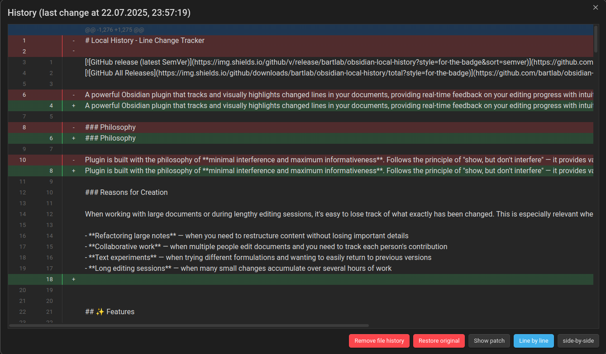

# Local History - Line Change Tracker

[](https://github.com/bartlab/obsidian-local-history/releases/latest)
[](https://github.com/bartlab/obsidian-local-history/releases)

A powerful Obsidian plugin that tracks and visually highlights changed lines in your documents, providing real-time feedback on your editing progress with intuitive visual indicators.

### Philosophy

Plugin is built with the philosophy of **minimal interference and maximum informativeness**. Follows the principle of "show, but don't interfere" — it provides valuable information about your changes while remaining unobtrusive and not disrupting your familiar workflow.

### Reasons for Creation

When working with large documents or during lengthy editing sessions, it's easy to lose track of what exactly has been changed. This is especially relevant when:

- **Refactoring large notes** — when you need to restructure content without losing important details
- **Collaborative work** — when multiple people edit documents and you need to track each person's contribution
- **Text experiments** — when trying different formulations and wanting to easily return to previous versions
- **Long editing sessions** — when many small changes accumulate over several hours of work


## ✨ Features

### 🎯 **Smart Change Detection**
- **Source Mode Only**: Activates exclusively when files are open in Source mode for precise tracking
- **Existing Files Focus**: Works only with previously saved files, ignoring new unsaved documents
- **Real-time Tracking**: Monitors changes as you type using CodeMirror 6 API

### 🎨 **Visual Indicators**
- **Line Markers**: Highlights changed lines with customizable colored indicators
- **Gutter Dots**: Alternative display mode with character indicators in the editor gutter
- **Auto-removal**: Markers automatically disappear when lines return to their original state
- **Multiple Change Types**: Different colors for added, modified, restored, and removed lines

### 📊 **Advanced History Features**
- **Original Content Preservation**: Stores the initial file state for accurate comparison
- **Diff Viewer**: Built-in modal with side-by-side and line-by-line diff views
- **Clean Patch Export**: Generate and copy clean patches with zero context
- **Smart Deletion Handling**: Properly tracks removed lines without affecting subsequent content

## 📸 Screenshots

[](screenshots/editor-lines.png)
[](screenshots/editor-gutters.png)

*The plugin highlighting changed lines in the editor*

[](screenshots/diff-line-by-line.png)
[](screenshots/diff-side-by-side.png)
[](screenshots/diff-patch.png)

*Built-in diff viewer showing changes side-by-side*

[](screenshots/settings.png)

*Customizable settings for different indicator types*

## 🚀 Installation

### Automatic Installation (Recommended)

1. Open Obsidian
2. Go to **Settings** → **Community plugins**
3. Disable **Safe mode** if it's enabled
4. Click **Browse** and search for "Local history" or "Line Change Tracker"
5. Click **Install** and then **Enable**

### Manual Installation

1. Download the latest release from the [GitHub releases page](https://github.com/bartlab/obsidian-local-history/releases)
2. Extract the files to your vault's plugins folder: `VaultFolder/.obsidian/plugins/local-history/`
3. Reload Obsidian
4. Enable the plugin in **Settings** → **Community plugins**

## 🎮 Usage

### Basic Operation

1. **Open an existing file** in Source mode
2. **Start editing** - the plugin automatically captures the original state
3. **See visual feedback** as you make changes:
   - <span style="color:DodgerBlue">⚪</span> **Blue**: Modified lines
   - <span style="color:orange">⚪</span> **Orange**: Added lines  
   - <span style="color:white">⚪</span> **Base**: Removed lines
   - <span style="color:gray">⚪</span> **Gray**: Restored lines

### Viewing Change History

- Use the command palette (`Ctrl/Cmd + P`) and search for "Show all changes"
- Or access via the plugin's commands to open the diff viewer modal

### Diff Viewer Features

- **Side-by-side view**: Compare original and current versions
- **Line-by-line view**: Unified diff format
- **Patch export**: Generate clean patches for external use
- **Synchronized scrolling**: Both panels scroll together in side-by-side mode

## ⚙️ Configuration

Access plugin settings via **Settings** → **Plugin Options** → **Local History**

### Display Options

- **Indicator Type**: Choose between line markers or gutter dots
- **Show Indicators For**: Toggle visibility for different change types
  - Changed lines
  - Added lines
  - Removed lines
  - Restored lines

### History Management

- **Keep History Until**: Choose when to clear tracking data
  - App close: Clear when Obsidian closes
  - File close: Clear when file tab closes

### Customization

- **Line Width**: Adjust the width of line indicators
- **Gutter Character**: Customize the character used in gutter mode
- **Colors**: Modify indicator colors via CSS snippets

#### Custom CSS Example

```css
/* Customize line change colors */
.lct-line.lct-changed:not(.mk-placeholder)::before {
    background-color: #ff6b35; /* Orange for changed lines */
}

.lct-line.lct-added:not(.mk-placeholder)::before {
    background-color: #4ecdc4; /* Teal for added lines */
}

.lct-line.lct-restored:not(.mk-placeholder)::after {
    background-color: #fcdb89; /* Yellow for restored lines */
}

.lct-line.lct-removed:not(.mk-placeholder)::after {
    background-color: #b6b6b6; /* Gray for removed lines */
}
```

## 🔧 Compatibility

- **Minimum Obsidian Version**: 0.15.0
- **Platform Support**: Desktop and Mobile
- **File Types**: Plain text files (`.md`, `.txt`, `.csv`, `.json`, `.yaml`)

## 💖 Support the Development

If you find this plugin helpful, consider supporting its development:

[](https://coff.ee/bartlaba)

Your support helps maintain and improve the plugin with new features and bug fixes!

## 🐛 Issues and Feedback

Found a bug or have a feature request? Please help improve the plugin:

1. **Check existing issues** on [GitHub Issues](https://github.com/bartlab/obsidian-local-history/issues)
2. **Create a new issue** with:
   - Detailed description of the problem
   - Steps to reproduce
   - Your Obsidian version
   - Your operating system
   - Screenshots if applicable

## 📄 License

This project is licensed under the MIT License - see the [LICENSE](LICENSE) file for details.

---

## 🛠️ For Developers

### Development Setup

#### Prerequisites

- **Node.js** (version 18 or higher)
- **npm** or **yarn**
- **Git**

#### Getting Started

1. **Clone the repository**
   ```bash
   git clone https://github.com/bartlab/obsidian-local-history.git
   cd obsidian-local-history
   ```

2. **Install dependencies**
   ```bash
   npm install
   ```

3. **Start development mode**
   ```bash
   npm run dev
   ```

4. **Build for production**
   ```bash
   npm run build
   ```

### Project Structure

```
obsidian-local-history/
├── src/                          # Source code
│   ├── commands/                 # Command definitions
│   ├── decorators/              # TypeScript decorators
│   ├── events/                  # Event handlers
│   ├── extensions/              # CodeMirror extensions
│   ├── helpers/                 # Utility functions
│   ├── lines/                   # Line tracking logic
│   ├── maps/                    # Data structures
│   ├── modals/                  # UI modals
│   ├── services/                # Core services
│   ├── settings/                # Settings management
│   ├── snapshots/               # File snapshot handling
│   ├── main.ts                  # Plugin entry point
│   └── types.ts                 # TypeScript type definitions
├── styles.css                   # Plugin styles
├── manifest.json                # Plugin manifest
├── package.json                 # Dependencies and scripts
├── tsconfig.json               # TypeScript configuration
├── esbuild.config.mjs          # Build configuration
└── README.md                   # This file
```

### Architecture Overview

The plugin follows a service-oriented architecture with dependency injection:

- **Services**: Core functionality (snapshots, settings, events)
- **Extensions**: CodeMirror 6 integrations for editor features
- **Commands**: Obsidian command palette integrations
- **Modals**: UI components for diff viewing
- **Helpers**: Utility functions and DOM manipulation

### Key Technologies

- **TypeScript**: Type-safe development
- **CodeMirror 6**: Editor integration and decorations
- **diff**: Text comparison and patch generation
- **diff2html**: HTML diff rendering
- **Obsidian API**: Plugin framework integration

### Contributing

1. **Fork the repository**
2. **Create a feature branch**: `git checkout -b feature/amazing-feature`
3. **Make your changes** following the existing code style
4. **Add tests** if applicable
5. **Commit your changes**: `git commit -m 'Add amazing feature'`
6. **Push to the branch**: `git push origin feature/amazing-feature`
7. **Open a Pull Request**

### Code Style

This project follows the [Google TypeScript Style Guide](https://google.github.io/styleguide/tsguide.html). Please ensure your contributions adhere to these standards.

### Testing

```bash
# Run tests (when available)
npm test

# Run linting
npm run lint

# Type checking
npm run type-check
```

### Release Process

1. Update version in `manifest.json` and `package.json`
2. Update `versions.json` with compatibility info
3. Create a git tag: `git tag -a 1.0.0 -m "Release 1.0.0"`
4. Push tags: `git push origin --tags`
5. GitHub Actions will automatically create a release

---

*Made with ❤️ for the Obsidian community*
